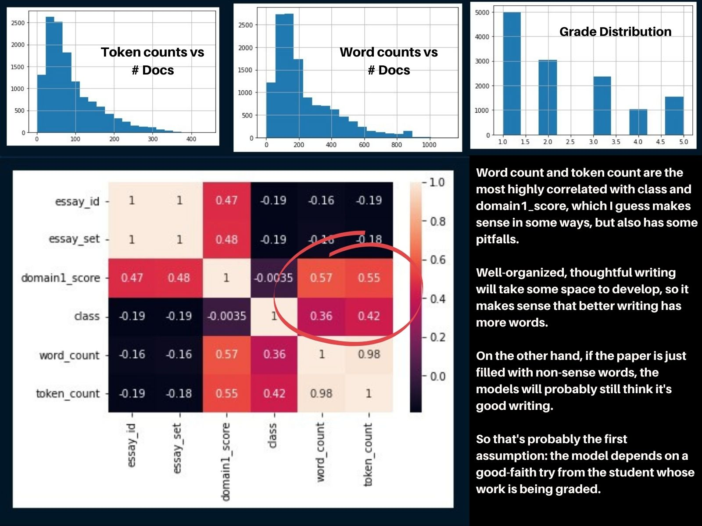

# Paper Grading Assistant

*Grading is the one of the top problems facing teachers in the US (Source: my teacher wife.) While it varies from subject to subject, many teachers spend upwards of several hours checking on the work of their students, in order to ensure growth and preparedness for their years ahead.*

*Because teachers are often over-worked and under-paid, the goal of this project is to help teachers reclaim some of that time and money by making the paper grading process more efficient. The result of doing that leads to more meaningful feedback for the students and more productive use of time for the teachers.*

## 1. Data

For this, there are 2 sources of data. The first: [Hewlett Foundation Kaggle Competition](https://www.kaggle.com/c/asap-aes/data). Here, I used this data to sort of prove the concept as well as test the idea.

The other set of data is from my teacher wife, who provided some student papers in order to test the idea in more of a production-esque setting.

## 2. Data Cleaning & Processing

### Training Data

The training data required very little cleaning. It was tokenized, punctuation and numbers were removed, and then lowercased. Afterwards, the remaining tokens were turned into embeddings using SciKit Learn's Text Vectorizer, and then fed into the model.

### Test and Production Data

This was where there was a sort of hiccup. Some of the actual data had text in various colors due to highlights and font colors used for teaching purposes. That caused problems with the text detection, and is addressed below in section 8. This problem resulted in 0 words being detected for some papers, so it's actually a bit of a major issue. I think it's largely an issue of finding a different library for handling PDFs. Because it was only 1-2 files that were affected (out of 60+), for the sake of this project, it was put on the back burner.

## 3. EDA

* **Word and Token Counts** seem to be the most correlated, as mentioned in the figure. And that makes a lot of sense.
* **Essay Sets** correlating very little was interesting because the different sets were different grade levels (i.e. students at different ages). The grades given were independent of student age (class vs essay set).

## 4. Method

The dataset has different scales for each essay set, which were all standardized as a score out of 100. These were then all given a "Letter Grade" (A, B, C, D, or F), which is the class that we are trying to predict. 

Additionally, Topic Modeling was used to examine the similarities between paragraphs. The idea there is to help a teacher leave feedback about how well a student organizes his or her thoughts.

More on these explained in the next section.

I initially had thought about this problem as a regression problem, and I wanted to predict the actual scores. After a few consults with my teacher wife, she suggested that, at least for her style of grading, it made more sense to quickly sort the papers into piles of A, B, C and so on. That way, she could spend more time commenting on papers that required extra time and less time figuring out which of those papers actually needed that kind of commentary. 

So that's the idea here: sort a classroom worth of papers into piles quickly, so that teachers will know who needs more attention vs the ones that just need quick input. English teachers generally still want to read the papers, and this doesn't take away from that. Instead it helps teachers focus on the enjoyable parts, and makes the grading process more efficient and effective.

## 5. Algorithms & Machine Learning

I tested several different classification models from [SciKit Learn](https://scikit-learn.org/stable/). After finding a few that were close in performance, cross-validation and tuning demonstrated that a Support Vector Machine was the best model.

>***NOTE:** Beyond accuracy, the most important metric was precision. I wanted as few false positives as possible. That way, on the papers the model does mis-classify, teachers are more likley to be giving points back instead of taking them away. SVM had both the highest accuracy and the highest precision, making it a pretty easy decision.*

Afterwards, the papers are processed with Latent Dirichlet Allocation to determine paragraph topics. The topics are then assessed with a pre-trained Word2Vec model to assess their similarities. Similar paragraphs get positive feedback; dis-similar paragraphs get suggested feedback ("These paragraphs may need clarification in how the topics are connected.")

## 6. Pseudo-Coldstart Threshold

**Coldstart Threshold**: Recommender systems have a unique issue: *what does the algorithm recommend to new users when it has very little or no prior data?* 

While not a recommender system, the goal here is to eventually have a teacher train the model in the way that the teacher likes to grade papers. Initially, they'll have a pre-trained model, but eventually, I hope to add a reinforcement learning/fine-tuning type of model, where teachers can apply feedback that iterates the model to suit their needs better.

## 7. Predictions

<a href="https://share.streamlit.io/maxemileffort/paper-grading-assistant/streamlit/app.py" target="_blank">[Live Demo]</a>

Teachers with student papers (perhaps from a previous year) can drop a .zip file on one of the upload inputs and receive some test grading recommendations. Other users without a student body to source documents from can use the demo papers, which are just a few random Wikipedia articles that the model grades.

## 8. Future Improvements

* The biggest problem was that the data used to build the MVP was all black and white. If the text has any highlighting or is colored anything besides black, the PDF reader just doesn't detect it. So that would be one of the first problems that needs solving.

* The algorithm used is quite simple, and so it is probably pretty easy to beat. Currently it just correlates word embeddings to a grade, and then looks at topics between paragraphs and tries to grade similarities. I would think that there would need to be some more layers for discerning a real grade, so I would like to build some deep learning models to help grade the papers.

## 9. Credits

Thanks to Kaggle for the free data, my wife for her guidance, and Mukesh Mithrakumar for being an extrememly knowledgeable and patient Springboard mentor.

Cover photo by [Green Chameleon](https://unsplash.com/@craftedbygc?utm_source=unsplash&utm_medium=referral&utm_content=creditCopyText) on [Unsplash](https://unsplash.com/s/photos/study?utm_source=unsplash&utm_medium=referral&utm_content=creditCopyText). 